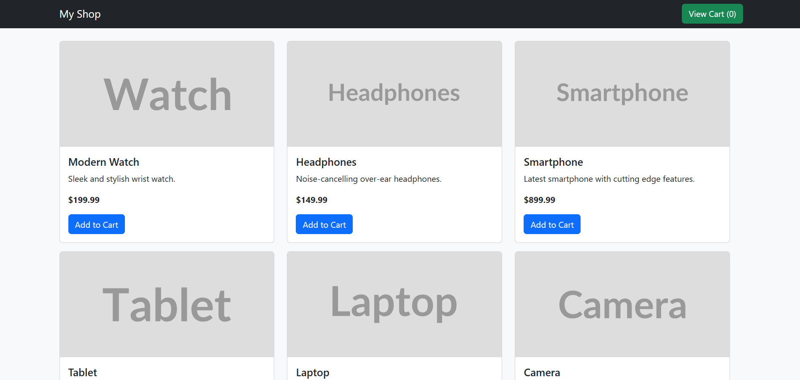

# 🛒 Shopping Cart App

A simple and modern shopping cart application built using **HTML**, **CSS**, **JavaScript**, and **Bootstrap 5**. This project showcases how to dynamically render products, manage cart items, and create an interactive cart modal without using any backend or framework.

---

## 📸 Demo



---

## ✨ Features

- ✅ Responsive and modern UI with Bootstrap 5  
- ✅ Dynamic product listing from a JavaScript array  
- ✅ Add to Cart functionality  
- ✅ Cart item quantity updates  
- ✅ Cart item removal  
- ✅ Modal-based cart with total price calculation  
- ✅ Placeholder product images using [placehold.co](https://placehold.co)

---

## 🧠 Technologies Used

- HTML5  
- CSS3  
- JavaScript (ES6+)  
- Bootstrap 5  
- Placehold.co for image placeholders

---

## 📂 Project Structure

```
📁 your-project-folder/
├── index.html           # Main HTML page
├── script.js            # JavaScript logic
└── README.md            # Project documentation
```

---

## 🛠️ How to Use

1. Clone or download this repository.
2. Open `index.html` in your browser.
3. Enjoy browsing and adding products to the cart!

---

## 📌 Notes

- This is a frontend-only project. No backend or local storage integration.
- Feel free to replace the placeholder product images with real ones.
- For advanced functionality like user login, orders, and checkout—backend integration is required.

---

## 🧾 License

This project is open-source and free to use for personal or commercial purposes.  
Feel free to give credit, but it's not required.

---

## ❤️ Credits

Made with ❤️ by Eyüp İrfan çelik  
Inspired by clean UI and practical JS projects.